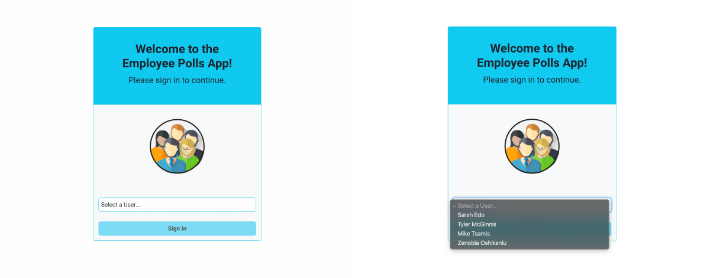
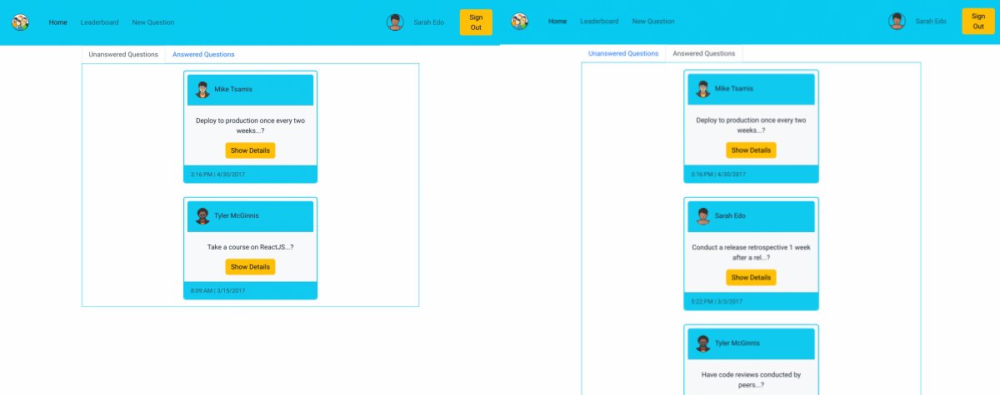
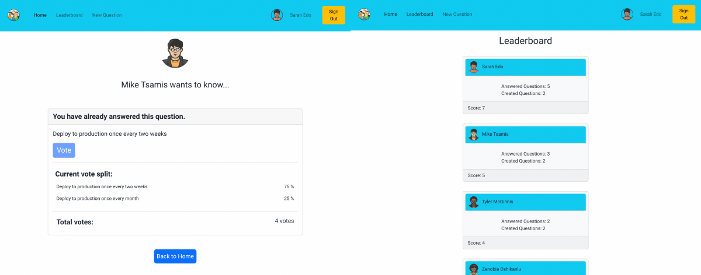
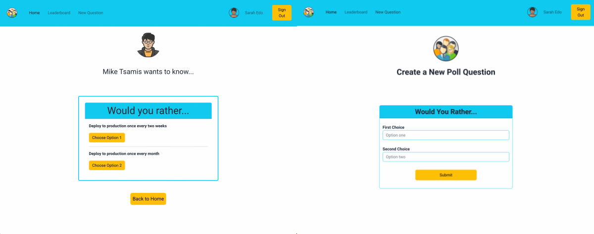

# Employee Polls Project: Udacity

## Overview

**Would You Rather** is the final project for Udacity's React Nanodegree program. It was designed to test our knowledge of React, Redux, and unit testing with React and Jest. The user is given questions with two possible choices. They can answer questions, see questions they haven't answered, see how other people voted, and see user ranking on the leaderboard page. Starter code is provided including a Data.js file, which represents a database and has methods to access the data. I bootstrapped this project using [Creact React App](https://github.com/facebook/create-react-app).

## Screen Shots of App

#### Login Page

## 

#### Home Page

## 

#### Answered Questions

## 

#### New Question

## 

## App Functionality

- Login: The user has a dropdown menu with a list of login in names. The user chooses one name to enter the app.
- Homepage: When the user logs in, they will see the homepage with tabs showing their unanswered and answered polls. The polls are ordered from newest (top) to oldest (bottom).
- Poll details: Each question has two answer options. After the user answers the question, they are taken to the next page that shows the percentage of people who voted for the same option. There will be a mark by the logged in user's name.
- 404 page: Users will see this page when a poll doesn't exist.
- Voting: User is only allowed to vote once for each poll.
- Post Question: Users can add a new question using the form on the New Question page. Once the user has added their choices, then they click the submit button to add their question.
- Leaderboard: This page includes the states for each user. The users are organized in descending order based on the number of questions they have asked and the number they have answered. Users who ask and answer more questions have a hire rating.

## Installation and Launch Instructions

- First you need to Clone or download this repository.
- Next you need to open a terminal in the project directory.
- Install **Node.js**. You can find the package using the following link:
  https://www.npmjs.com/get-npm
- Install all project dependencies with `npm install`.
  - Dependencies You Need to Install:
    - react-router-dom
    - react
    - react-dom
    - react-redux
    - react-redux-loading
    - react-scripts
    - redux
    - redux-thunk
- Then run, `npm start` to display the application.
- To run tests, use `npm test`.

## References and Resources

### References

Avatar images:

- [Pixabay](https://pixabay.com/)

* [SketchandBuild](https://www.flaticon.com/free-icons/afro)

This project was bootstrapped with [Create React App](https://github.com/facebook/create-react-app).
